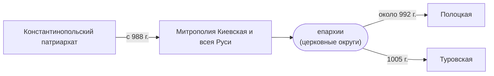

## Причины
- Тесные связи с христианской Европой, Византией
- Желание Киевских князей занять место в европейской политике
- Возможность культурного развития

## Ход событий, устройство церкви, деятели
- Князь Киевский *Владимир* - в **998** принял христианство и *крестил Русь*
- Князь Полоцкий *Изяслав* - в **992** основал первую христианскую *епархию (церковный округ)* на терр. Беларуси
- *Рогнеда* - мать Изяслава - постриглась в монахини под именем Анастасия
>[!info] Убедить язычников сменить веру было непросто, долго существовало двоеверие

- Просветители - способствовали распространению письменности и христианства
	- *Ефросиния Полоцкая* - происходила из княжеской семьи, но вместо замужества постриглась в монастырь. Основала два монастыря, способствовала строительству двух церквей, переписывала книги.
	- *Кирилл Туровский* - известен как выдающийся писатель и оратор, писал поучения, молитвы, каноны.

## Значение и последствия
- Культура
	- *Развитие письменности и летописания*, появление старославянской азбуки - *кириллицы*, созданной христианскими монахами Кириллом и Мефодием. Найдены берестяные грамоты, камни с высеченными посланиями.
	- *Развитие каменного зодчества*, примеры - Софийский собор, Борисоглебская церковь.
	- *Распространение иконописи, фресковой живописи*
- Изменения в быте и в отношениях между людьми (соблюдение заповедей, т.д.), отказ от старых обычаев
- Укрепление государственной власти
- Изменение международного положения